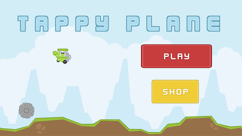
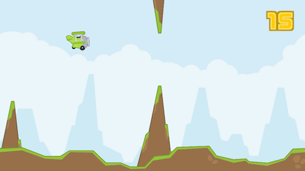
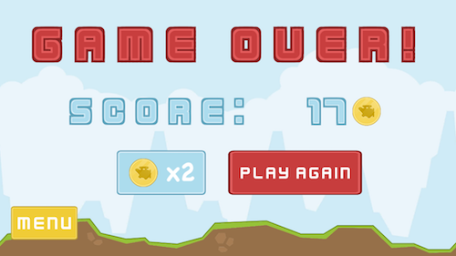
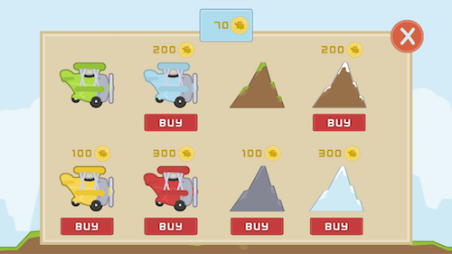

# Tappy Plane

*Tappy Plane* is a *Flappy Bird* style endless runner in which the player taps the screen to fly their plane in between obstacles, thus earning coins which can be used to unlock other planes and levels. Created as part of **#GameInAWeek**, the goal of *Tappy Plane* was to take a simple game idea and create a small yet fully functioning game with:
* Game settings saved to disk
* Localization
* Audio Manager
* In-App currency and Store
* Unity Ads
* Optimized assets (Sprite Packer)
* iOS Launch Screen

This project may be quite useful for those looking for a starting point in creating an endless runner for mobile. It is released under an MIT license.

## Screenshots

<table style="width:100%">
  <tr>
    <th></th>
    <th></th> 
  </tr>
  <tr>
    <th></th>
    <th></th> 
  </tr>
</table>

## Play Online

Although the game is optimized for mobile (Android and iOS), it can be played in the browser [here](https://defuncart.itch.io/tappyplane).

## Credits

A full list of credits can be found in [Credits.txt](Credits.txt).

## Further Reading

A number of principles utilized in this project are explained in more detail in various [#50-Unity-Tips](https://github.com/defuncart/50-unity-tips) articles:

* Binary Serialization
* JSON Serialization
* Singletons
* LocalizationManager
* AudioManager
* iOS Launch Screen