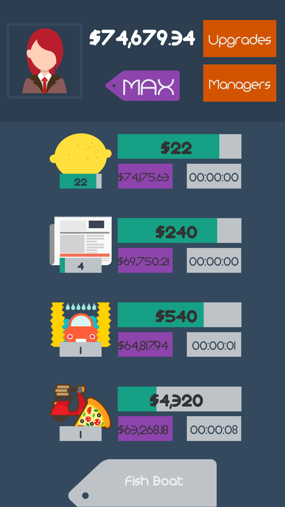

# Idle Capitalist

*Idle Capitalist* is an idle clicker game inspired by *AdVenture Capitalist* in which the player invests funds into certain businesses to generate revenue. The project was created for educational purposes as part of James’ **#GameInAWeek** challenge and is released freely under an MIT license. This project may be quite useful for those looking for a starting point in creating an idle game in Unity for mobile. Bugs and feedback welcomed! [@defuncart](https://twitter.com/defuncart)

## Screenshots

<table style="width:100%">
  <tr>
    <th></th>
    <th></th>
    <th></th>
    <th></th>
  </tr>
</table>

## What's Included

* Business, Manager, and Update data are stored as customs assets.
* Modular approach in which new businesses, managers or updates can easily be added.
* Player data is saved to disk (via Binary Serialization).
* Localization is incorporated throughout.
* Optimized assets (Sprite Packer).
* iOS Launch Screen.
* A complete write-up of the game design can be found in [GameDesignDocument.pdf](GameDesignDocument.pdf).

## Play Online

The game can be played in the browser [here](http://defuncart.github.io/game-in-a-week/IdleCapitalist/).

## Conclusion

Although the mathematics of idle games are quite complex, and game balancing wasn't even considered due to time constraints, from an implementation point of view, *Idle Capitalist* is quite a well-functioning idle clicker. This prototype could easily be extended to form a full game.

## Further Reading

A full list of credits can be found in [Credits.txt](Credits.txt).

A number of principles utilized in this project are explained in more detail in various [#50-Unity-Tips](https://github.com/defuncart/50-unity-tips) articles.

*The Math of Idle Games* [Part I](http://blog.kongregate.com/the-math-of-idle-games-part-i/), [Part II](http://blog.kongregate.com/the-math-of-idle-games-part-ii/) and [Part III](http://blog.kongregate.com/the-math-of-idle-games-part-iii/).
