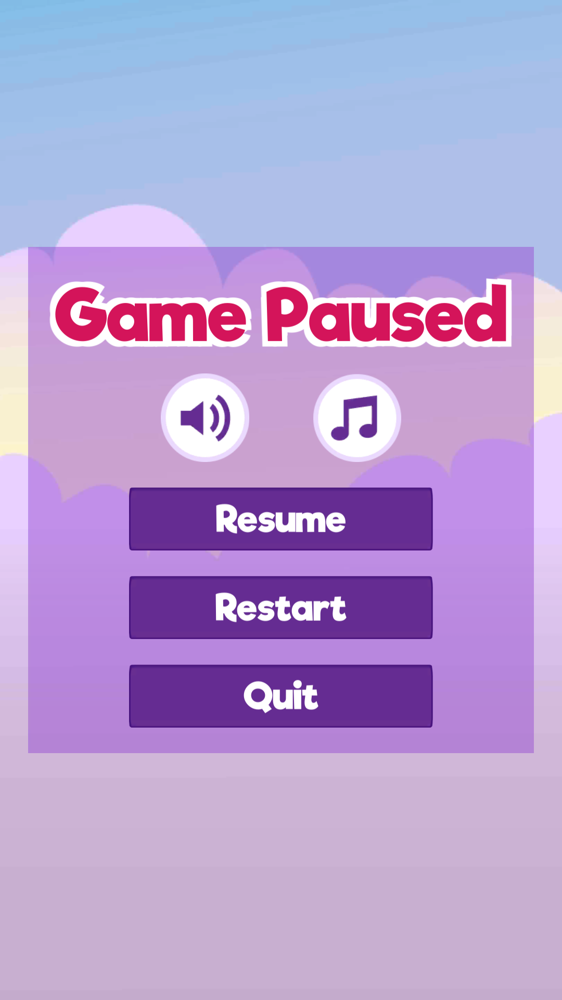

# Sultan's Gems

*Sultan’s Gems* is a simple Match 3 game in which the player tries to achieve a high score within a certain number of moves by matching similar pieces. The project was created for educational purposes as part of James’ **#GameInAWeek** challenge and is released freely under an MIT license. It may be of interest to those looking for a starting point in creating a Match 3 game in Unity for mobile. Bugs and feedback welcomed! [@defuncart](https://twitter.com/defuncart)

## Screenshots

<table style="width:100%">
  <tr>
    <th></th>
    <th></th>
    <th></th>
    <th></th>
  </tr>
</table>

## What's Included

* Level data is stored as customs assets. Board shape, pieces to initially place, points per stone and which stones are valid can all be assigned in the editor.
* Modular approach in which new levels can easily be added.
* Player data is saved to disk (via Binary Serialization).
* Localization is incorporated throughout.
* Optimized assets (Sprite Packer).
* iOS Launch Screen.
* A complete write-up of the game design can be found in [GameDesignDocument.pdf](GameDesignDocument.pdf).

## Play Online

The game can be played in the browser [here](http://defuncart.github.io/game-in-a-week/SultansGems/).

## Conclusion

Although the match 3 market is over saturated and these games require considerable amount of game balancing, from an implementation point of view, *Sultan's Gems* is is a simple yet functioning match 3 game. This prototype could easily be extended to form a full game.

## Further Reading

A full list of credits can be found in [Credits.txt](Credits.txt).

A number of principles utilized in this project are explained in more detail in various [#50-Unity-Tips](https://github.com/defuncart/50-unity-tips) articles.
