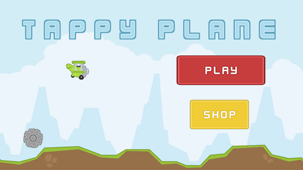
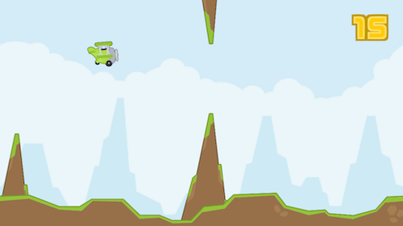
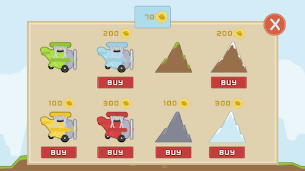

# Tappy Plane

*Tappy Plane* is a *Flappy Bird* style endless runner in which the player taps the screen to fly their plane in between obstacles, thus earning coins which can be used to unlock other planes and levels. Created as part of **#GameInAWeek**, the goal of *Tappy Plane* was to take a simple game idea and create a small yet fully functioning game with:
* Gameplay speed increases with time.
* Game settings saved to disk
* Locailzation implemented throughout.
* Audio Manager
* In-App currency and In-App Store
* Unity Ads
* Optimized assets (Sprite Packer)
* iOS Launch Screen

This project may be quite useful for those looking for a starting point in creating an endless runner for mobile. It is released freely under an MIT license.

## Screenshots

<table style="width:100%">
  <tr>
    <th></th>
    <th></th> 
  </tr>
  <tr>
    <th></th>
    <th></th> 
  </tr>
</table>

## Play Online

The game can be played in the browser [here](https://defuncart.itch.io/tappyplane).

## Conclusion

Although the endless runner market is quite saturated, this project shows that from an implementation point of view, such a game is very straightforward to develop. With a unique idea and artstyle, and this template coudl be fleshed out into a full game.

## Further Reading

A full list of credits can be found in [Credits.txt](Credits.txt).

A number of principles utilized in this project are explained in more detail in various [#50-Unity-Tips](https://github.com/defuncart/50-unity-tips) articles:

* Binary Serialization
* JSON Serialization
* Singletons
* LocalizationManager
* AudioManager
* iOS Launch Screen